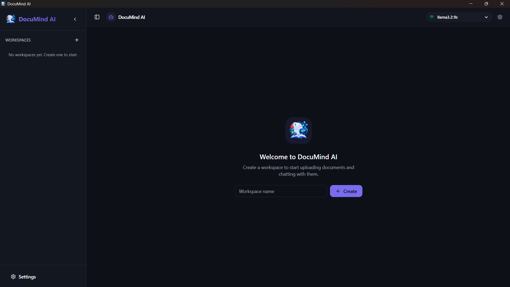
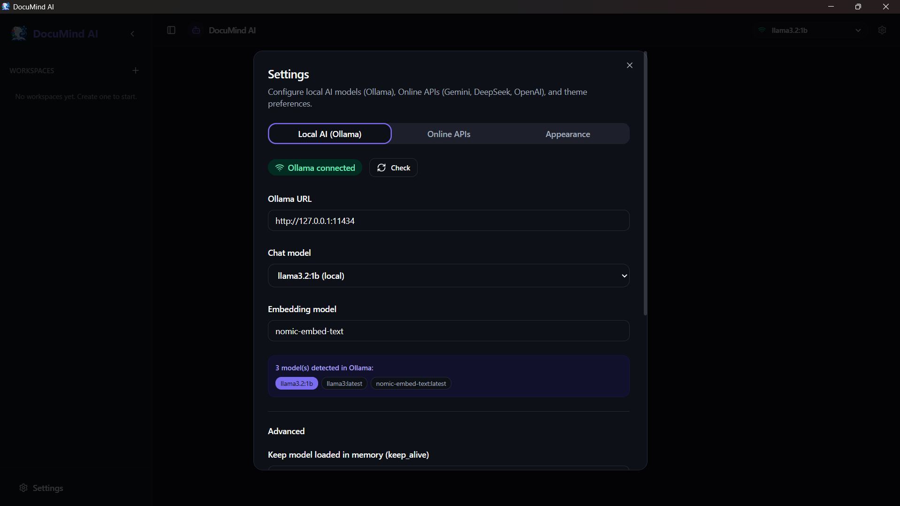
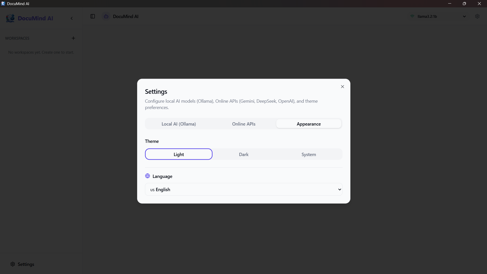
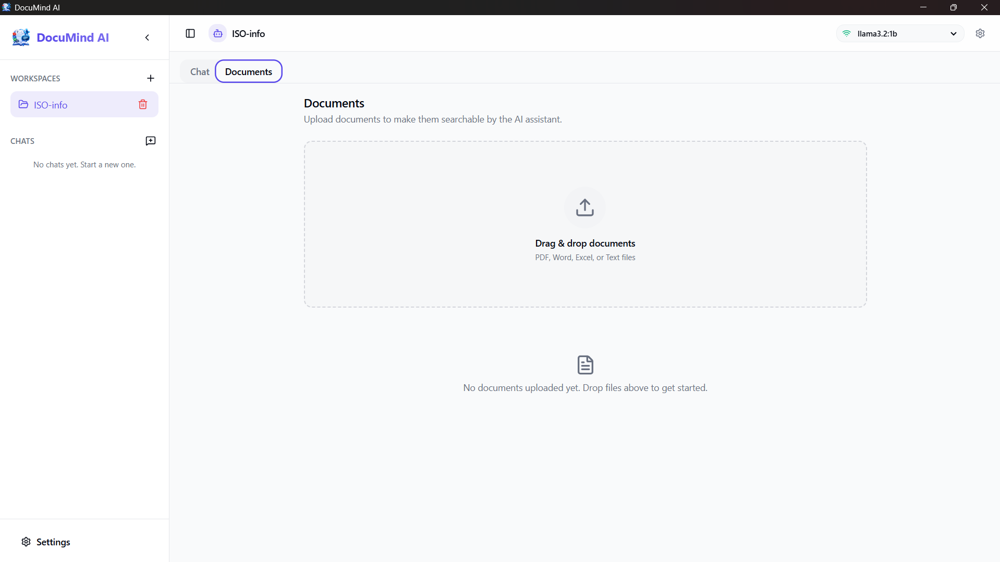
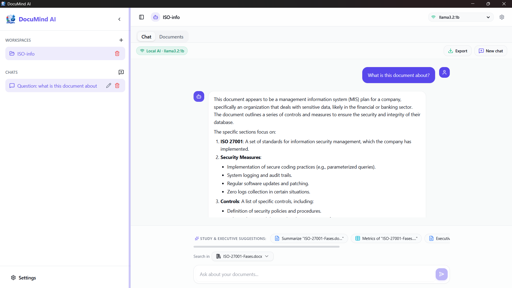

<div align="center">

# DocuMind AI Web

**Chatea con tus documentos. Nada sale de tu equipo.**

Landing page del software de escritorio **DocuMind AI**: una base de conocimiento personal que responde preguntas sobre tus PDF, Word, Excel y archivos de texto usando un modelo de lenguaje local.


[Ver la web](https://fguzman-stack.github.io/DocuMind-Ai-Web/) · [Cómo se publica](#publicación-en-github-pages) · [Empezar](#instalación)

</div>

---

## Índice

- [Funcionalidad](#funcionalidad)
- [Capturas](#capturas)
- [Cómo funciona](#cómo-funciona)
- [Seguridad y privacidad](#seguridad-y-privacidad)
- [Tecnologías](#tecnologías)
- [Requisitos](#requisitos)
- [Instalación](#instalación)
- [Uso](#uso)
- [Idiomas](#idiomas)
- [Publicación en GitHub Pages](#publicación-en-github-pages)
- [Autor](#autor)

---

## Funcionalidad

**DocuMind AI** es una aplicación de escritorio que convierte tus documentos en una base de conocimiento personal y te permite conversar con ella:

| Capacidad | Descripción |
| --- | --- |
| **100% local por defecto** | El parseo, los embeddings, la búsqueda y la generación corren en tu máquina desde la primera pregunta. |
| **Motor en la nube, opcional** | Activa Gemini, DeepSeek u OpenAI solo para redactar la respuesta final; la búsqueda sigue siendo local. |
| **Fuentes verificables** | Cada respuesta muestra los fragmentos exactos usados, con su puntaje de similitud, como en un artículo académico. |
| **Workspaces aislados** | Organiza documentos y chats en proyectos independientes; los datos nunca se mezclan. |
| **Progreso en tiempo real** | Una barra de avance muestra cada paso mientras se analizan, fragmentan e indexan tus archivos. |
| **Interfaz en 5 idiomas** | Inglés, español, portugués, francés y alemán, con detección automática del idioma del sistema. |

Formatos soportados: **PDF**, **DOCX**, **XLSX** y **TXT**.

---

## Capturas



| | |
|---|---|
|  |  |
|  |  |

---

## Cómo funciona

De un archivo a una respuesta con fuentes, en cinco pasos y todos dentro de tu equipo:

1. **Analizar** — Extrae el texto de PDF, DOCX, XLSX o TXT. Los PDF usan un motor de respaldo si el primero falla.
2. **Fragmentar** — Divide el texto en piezas de 1000 caracteres con 50 de solape, para no cortar ideas a la mitad.
3. **Vectorizar** — Convierte cada fragmento en un vector de 768 dimensiones con `nomic-embed-text`, en grupos concurrentes.
4. **Indexar** — Guarda los vectores en SQLite, en lotes de 100 filas, listos para búsqueda por similitud.
5. **Responder** — Al preguntar, se buscan los 5 fragmentos más cercanos y se generan la respuesta y sus fuentes.

```
Documento → Fragmentos → Vectores → Motor local → Respuesta
```

---

## Seguridad y privacidad

La privacidad es el corazón del producto. Este es el mapa exacto de qué se guarda y qué se envía:

| Dato | Dónde se guarda | ¿Sale de tu equipo? |
| --- | --- | --- |
| Tus archivos | Tu disco | Nunca |
| Texto extraído | SQLite · `document_texts` | Nunca |
| Embeddings | SQLite · `chunks.vector` | Nunca |
| Historial de chat | SQLite · `messages` | Nunca |
| Claves de API | SQLite · `settings` | Solo al llamar al proveedor elegido |
| Pregunta + contexto recuperado | Memoria, durante la consulta | Solo si activas la nube |

Tus archivos, el texto extraído y los vectores **nunca** salen de tu equipo, elijas el motor que elijas. La recuperación de información es siempre local; solo la redacción de la respuesta final puede delegarse a la nube, y únicamente si tú lo activas.

---

## Tecnologías

La interfaz web está construida con HTML, CSS y JavaScript puros (sin frameworks), con diseño responsive y modo oscuro.

El software de escritorio detrás de la web usa:

| Capa | Tecnología |
| --- | --- |
| Shell de escritorio | Tauri 2 |
| Frontend | React 19 · TypeScript 5.8 · Vite 7 · Tailwind CSS |
| Estado | Zustand |
| Persistencia | SQLite |
| LLM local | Ollama (`llama3.2:1b`) |
| Embeddings | Ollama (`nomic-embed-text`, 768 dim) |
| Parseo | pdfjs-dist · mammoth · SheetJS |

---

## Requisitos

- Node.js **22+**
- Rust **estable**
- Ollama **instalado y en ejecución**

---

## Instalación

### 1. Instala los modelos

```bash
# chat / generación (~1.3 GB)
ollama pull llama3.2:1b

# embeddings (274 MB, 768 dim)
ollama pull nomic-embed-text
```

### 2. Instala las dependencias

```bash
npm install
```

### 3. Ejecuta la app

```bash
npm run tauri dev
```

---

## Uso

1. Abre la app y crea o selecciona un **workspace**.
2. Arrastra tus documentos (PDF, DOCX, XLSX o TXT). Observa el progreso en tiempo real del análisis, fragmentación e indexación.
3. Haz preguntas sobre el contenido. Cada respuesta incluye sus **fuentes** con el puntaje de similitud.
4. Si lo deseas, configura una clave de API (Gemini, DeepSeek u OpenAI) para que la nube redacte la respuesta final. El resto sigue siendo local.

> La web que vive en este repositorio es la landing page: explica el producto, muestra sus capturas y guía la instalación. La app de escritorio en sí es otro proyecto.

---

## Idiomas

La interfaz se traduce automáticamente al idioma del sistema y permite cambiar manualmente entre:

- Español
- English
- Português
- Français
- Deutsch

---

## Publicación en GitHub Pages

El sitio es estático, por lo que se publica directamente desde la rama `main`:

1. Ve a **Settings → Pages** del repositorio.
2. En **Build and deployment → Source**, selecciona **Deploy from a branch**.
3. En **Branch**, elige `main` y carpeta `/ (root)`.
4. Guarda. En menos de un minuto el sitio queda disponible en:

```
https://fguzman-stack.github.io/DocuMind-Ai-Web/
```

No se necesita ningún archivo de configuración: no hay build, el contenido se sirve tal cual desde la raíz.

---

## Autor

**Francisco Guzmán**

- GitHub: [fguzman-stack](https://github.com/fguzman-stack)
- Proyecto: [DocuMind-Ai-Web](https://github.com/fguzman-stack/DocuMind-Ai-Web)